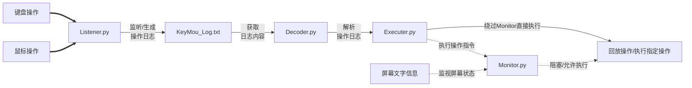

# KeyMou

### 功能列表

- [x] 鼠标和键盘操作监听
- [x] 鼠标 左右中键单击 / 左键双击 / 拖拽 的回放
- [x] 鼠标滚轮上下滚动回放
- [x] 键盘操作回放
    - [x] 支持字母和数字输入
    - [x] 支持部分 Ctrl 和 Shift [组合键输入](1_Code/Header.py)
    - [x] 支持部分特殊字符输入
    - [x] 控制台告警提示信息
- [x] 屏幕文字识别
    - [x] 屏幕指定区域中/英文识别
    - [ ] 优化区域划定流程
- [ ] 任务进度提示

### 使用方法

1. 使用环境： Windows + Python3

```powershell
PS C:\Users\ZHJ\Desktop\KeyMou> python -V
Python 3.11.5
```

2. 安装依赖

> **Note:** 若安装报错请查看[此日志](3_Docs\ocr_setup_log.md)

```powershell
PS C:\Users\ZHJ\Desktop\KeyMou> pip install -r requirements.txt
```

3. 运行监听程序，录制需要执行的动作

```powershell
PS C:\Users\ZHJ\Desktop\KeyMou\1_Code> python .\Listener.py
开始运行，日志文件将保存到: "../2_Log/KeyMou_log_20230917_233200.txt"   # 这里是录制的监听日志路径
按下 ESC 键并 晃动鼠标 停止监听...
监听程序结束
```

4. 修改 Executer.py 文件中第 7 行的监听日志路径

```powershell
--→ PRINT_LOG_PATH = "../2_Log/print_log_20230916_181238.txt"
```

5. 运行执行程序，回放监听器录制的操作

```powershell
PS C:\Users\ZHJ\Desktop\KeyMou\1_Code> python .\Executer.py
```

6. 另外可以运行监视程序，根据屏幕信息控制任务进度

```powershell
# 忽略无效的告警信息
PS C:\Users\ZHJ\Desktop\KeyMou\1_Code> python -W ignore .\Monitor.py
```

### 设计思路



### 工程结构

```
KeyMou
├─ 1_Code
│  ├─ Controller.py --→ 仅测试用
│  ├─ DataStruct.py --→ 键盘鼠标操作结构体
│  ├─ Decoder.py    --→ 译码器用于解析操作命令
│  ├─ Executer.py   --→ 执行器用于执行操作命令
│  ├─ Header.py     --→ 存放一些公共资源
│  ├─ Listener.py   --→ 监听器用于获取键鼠操作
│  └─ Monitor.py    --→ 监视器用于获取屏幕状态
├─ 2_Log            --→ 操作日志文件
└─ 3_Docs           --→ 资料文件
   └─ examples      --→ 示例文件
```

### 目前已知 Bug

* 无法处理的按键包括 `,`、`=`、`'`，问题定位在 `decode_operate()`

### 依赖项目

* pynput ( LGPL-3.0 license ) - Sends virtual input commands [[Github](https://github.com/moses-palmer/pynput)]
* CnOCR ( Apache-2.0 license )- 基于 PyTorch/MXNet 的中文/英文 OCR Python 包 [[Github](https://github.com/breezedeus/cnocr)]
